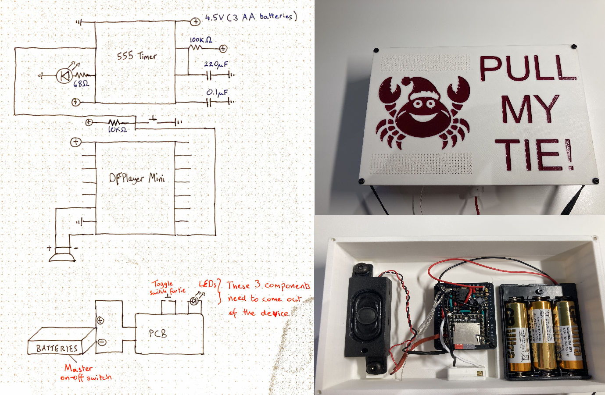

# 🎄 christmas-2024-tie

Welcome to **christmas-2024-tie** - a festive, ridiculous, and slightly petty electronics project born from an annual tradition of absurdity.

## 🎁 The Backstory

Every year, my cousin and I engage in our favorite Christmas tradition: mutual torment disguised as holiday fun. It involves themes, costumes, and a lot of regrettable public embarrassment. The rules are simple: make the other person wear something so ridiculous they’ll wish they never agreed to this cursed tradition.

For Christmas 2024, the theme was ties, which my cousin foolishly thought would be easy to survive. Alas, when I remembered his passionate hatred for "Shiny" from Moana, I realized I had the chance to create something that would haunt his holidays forever...and maybe mine too.

## 🦀 Introducing: The Christmas Crab Tie

Want to hear it for yourself? Click the gif below to experience the crustacean-powered musical magic in action.

  

What started as a humble tie ended up as a masterpiece of revenge and holiday cheer. Here's what it does:

- Comes to life when you pull the tie - the mechanism is a trusty pull-cord light switch (yes, the kind from your nan’s bathroom) wired into a 555 timer circuit
- Pulling the tie triggers a quick blast of "Shiny" from Moana, complete with flashing lights for maximum theatrical horror
- The timer limits the chaos to half a minute - which is just long enough to be annoying, and just short enough that people immediately want to pull it again

## 🛠️ Crab-a-tronics 101: Inside the Madness

Okay, so it’s not exactly NASA-grade engineering - but somehow, against all odds, it works. And **not a microcontroller in sight**. Held together by hope, hot glue, and questionable decisions, here’s how this crab-powered contraption comes to life:
- 🧰 **Mechanical Setup**: The electronics are housed inside a [3D-printed box](https://a360.co/3EqJN49), securely fastened to a rigid necklace. The tie itself is elastic and connected to a classic pull-cord light switch. When someone pulls the tie, the elastic stretches while the box stays put - this motion activates the switch without yanking everything off your neck.
- ⚡ **Electronic Setup**: That pull grounds the trigger pin on a 555 timer IC (wired in monostable mode) and the trigger pin on a DFPlayer Mini. The timer’s output stays high for about 30 seconds, powering a set of LEDs. Meanwhile, the DFPlayer Mini kicks off its one-job performance.
- ⏱️ **Timing Control**: The duration is set by the RC timing circuit; a $100k\Omega$ resistor and $220\mu F$ capacitor connected to the 555 timer. In this case, it's tuned to ~30 seconds of pure festive irritation.

In short: you pull the tie → it triggers a 555 timer → that timer powers lights and music for 30 seconds → someone else pulls it again. Rinse and repeat until your dignity evaporates or the battery dies, whichever comes first.

## 🧪 Future Ideas (aka How to Make It Worse)

- Add a motion sensor to restart the song every time someone gets close
- Upgrade the light show with addressable LEDs
- Bluetooth app to control song choice on the fly
---
> 🧠 *"It's not about looking good. It's about making them look worse." – Ancient Cousin Wisdom*
